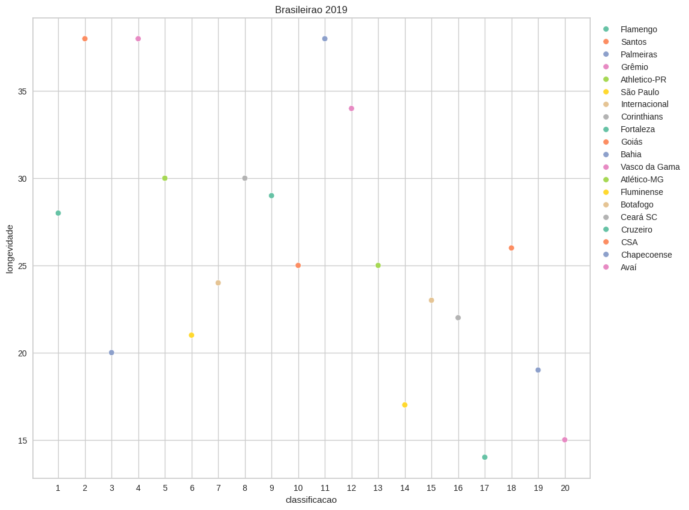

# Brasileirão e Serie A

O **Campeonato Brasileiro**, também conhecido como **Brasileirão** e **Série A**, é a liga brasileira de futebol profissional entre clubes do Brasil, sendo a principal competição de futebol no país. Nela são indicados os representantes brasileiros para a Copa Libertadores da América, juntamente com o campeão da Copa do Brasil. O vencedor do torneio também garante uma vaga na Supercopa do Brasil no ano seguinte.

# Escopo do projeto

#### Para reprodutibilidade do PR sugere a seguintes orientações:

```
bash

conda create -n myvenv python=3.9

conda activate myvenv

pip install -r Requirements.txt

conda deactivate

```

O projeto tem como base as fases e o uso do CRISP-DM para a solução do problema, com pequenas adaptações para o **PR_V1**

Seguindo as seguintes etapas:

1. Business understanding
2. Data Understanding
3. Data Preparation
4. Modeling
5. Evaluation
6. Deploy
7. Feedbacks


### PS: o V1 não comtempla o Deploy e Feedbacks após o deploy.

# Business understanding


Uma nova equipe profissional, o **ADA-Santander Futebol Clube**, emerge no cenário nacional com uma visão revolucionária. Sua diretoria e gerência estão empenhadas em transformar o panorama do futebol, não apenas no âmbito nacional, mas também em escala global. Acreditam firmemente que os dados, até então subutilizados, são a chave para o sucesso, contrastando com a abordagem tradicional e muitas vezes emocional que permeia as decisões no esporte.

O ADA-Santander Futebol Clube está adotando uma abordagem inovadora ao implementar uma administração baseada em dados (DATA-DRIVEN). Essa mudança abrange diversos setores cruciais para o desempenho do clube, incluindo contratações, renovações de contratos, negociações salariais, demissões e até mesmo a seleção e contratação de técnicos.

Acreditando que a análise de dados pode fornecer insights valiosos e informar estratégias mais eficazes, a equipe está comprometida em trazer uma mentalidade mais fundamentada e científica para as decisões que impactam diretamente o desempenho e o sucesso da equipe. Essa abordagem inovadora busca não apenas melhorar os resultados no campo, mas também estabelecer um novo padrão de excelência no universo do futebol, destacando-se pela eficiência, planejamento estratégico e vanguarda tecnológica.


# Data Understanding

Foi utilizado um conjunto de dados modelo referente ao Campeonato Brasileiro de 2019, apresentando a estrutura em formato JSON, com um total de 38 colunas e 10 linhas. Não foram identificados dados duplicados, valores NaN ou nulos dentro do nosso conjunto de dados.

Cada célula continha dados estatísticos dos jogos de cada rodada.


Foi empregado um código de teste para extrair as informações necessárias de apenas uma única célula.


Após o sucesso na extração das informações, criamos uma tabela Pandas para facilitar a visualização dos resultados.


# Data Preparation 

Para a preparação dos dados, criamos uma função que recebe como parâmetro o dataset a ser analisado. Segue um exemplo do código implementado.

Os dados foram extraídos e manipulados para obtermos informações como colocações finais, saldo de gols, longevidade dos técnicos e gols feitos.


## Obtendo um resultado 


# Conclusāo 

O questionamento levantado pela diretoria sobre a existência de uma relação entre a longevidade e a posição final dos times não pode ser respondido de forma taxativa.



No entanto, para uma resposta mais visual, utilizamos o gráfico de regressão e um mapa de calor (heatmap) para compreender a correlação entre as variáveis.

**REGPLOT**


**HEATMAP**


Através desses dois gráficos, podemos compreender que a longevidade apresenta uma correlação média com a colocação final. No entanto, dado que estamos analisando apenas um único ano, evitamos fazer afirmações mais enfáticas para evitar viés em nossa análise.

# Muito Obrigado
**Colaboradores**

Ane Carol - https://www.linkedin.com/in/anecarolineferreira/

Chen Yen Pin - https://www.linkedin.com/in/chen-yen-pin/

Jesya de Lima - https://www.linkedin.com/in/jesyadelima/

Gabriel Alvarenga - https://www.linkedin.com/in/gabriel-alvarenga-rocha-994b5120a/

Gabriel Vilarinho - https://www.linkedin.com/in/gabriel-vilarinho/

Grabriela Mendes - https://www.linkedin.com/in/gabriele-mendes-adorno-46719493?utm_source=share&utm_campaign=share_via&utm_content=profile&utm_medium=android_app

Renan Silva - https://www.linkedin.com/in/renan-msilva?utm_source=share&utm_campaign=share_via&utm_content=profile&utm_medium=android_app 

Marcel Cleres - https://www.linkedin.com/in/marcelcleres/


